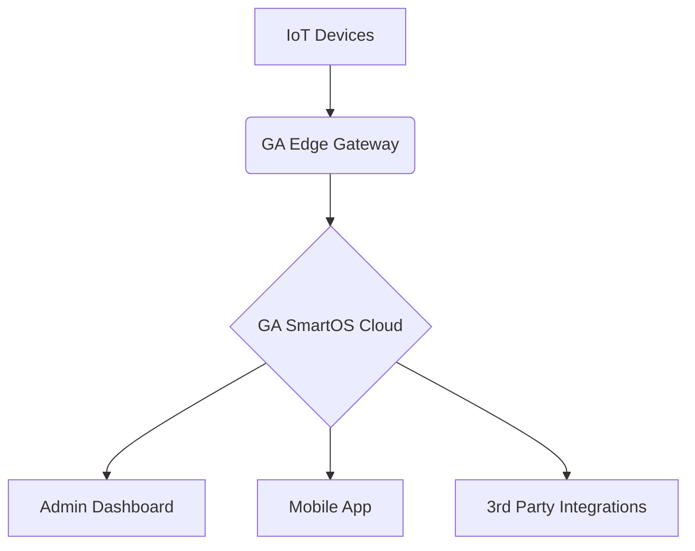

````
# 🚀 Godara & Arya Applications Pvt. Ltd.  
### *Pioneering IoT & Robotics for Next-Gen Automation*  
**🌐 [www.gaapplications.com](https://www.gaapplications.com) | 📍 Hisar, India 

---

## 🔥 Core Expertise  
**Smart Automation | AI Surveillance | Robotics | IoT Security Systems**

### 🧠 Our Innovation Pillars  
- AI-powered Edge Surveillance  
- Robotics with SLAM & LIDAR  
- IoT Ecosystems using MQTT, LoRaWAN  
- Secure Automation with Real-Time Control

---

## 🛠️ Our Technology Stack  
| **Domain**       | **Proprietary Solutions**                     | **Tech Used**                |
|------------------|---------------------------------------------|-----------------------------|
| Access Control   | BioCloud™ (Biometric/RFID Management)       | Python, TensorFlow, Edge AI |
| Video Analytics  | SentinelAI™ (Real-Time Threat Detection)    | OpenCV, YOLO, NVIDIA Jetson |
| IoT Automation   | GA SmartOS™ (Unified Dashboard)             | Node-RED, MQTT, AWS IoT     |
| Smart Water      | AquaFlow™ (Leak Detection & Analytics)      | LoRaWAN, Predictive ML      |

---

## 🌟 Flagship Products  
### **1. GA Secure™ Suite**
- Facial Recognition Turnstiles  
- Anti-Tailgating Alerts  
- AES-256 Encrypted CCTV Cloud  

### **2. GA Connect™ Ecosystem**
- **Mobile App:** Remote control & alerts  
- **Web Portal:** Unified automation dashboard  
- **API Library:** Custom device control

```python
# Sample API: Get Device Status
import requests
api_url = "https://api.gaapplications.com/v1/device/status"
headers = {"Authorization": "Bearer YOUR_API_KEY"}
response = requests.get(api_url, headers=headers)
print(response.json())
````

---

## ⚙️ Architecture at a Glance



---

## 🏆 Recent Achievements

* **2024:** Deployed India’s 1st Alexa-integrated smart gate system
* **2023:** Named *Top 10 IoT Startups* by TechIndia
* **2022:** Filed patent for pedestrian safety AI algorithm

---

## 📈 Why Choose Us?

✅ 100+ Successful Installations
✅ AES-256 Secure Protocols
✅ Smart City & Home Integration
✅ 24x7 Support & Monitoring
✅ Fully Made in India 🇮🇳

> *"We don't just automate. We innovate."* — **Team GA Applications**

---

## 📫 Connect With Our Team

**IoT Contact Hub**
📧 Email: [home@gaapplications.com](mailto:home@gaapplications.com)
📞 Call: +91 91384 22275
🏠 Address: 2, A Block, Defence Colony, Hisar, Haryana 125001

---

## ✨ Meet Our Visionaries

### 👨‍💼 Chaitanya Godara — *Managing Director & Head of Innovation*

> Leads product R\&D, strategic vision, and AI-driven innovation
> “True innovation solves real problems, not just creates shiny features.”
> [Connect on LinkedIn](#)

### 👩‍💼 Nikita Arya — *Director of Operations & Product Design*

> Heads design, compliance, team operations & UX strategies
> “Great code is like poetry—every line should serve a purpose.”
> [Connect on LinkedIn](#)

---

## 🧠 Smart Solutions We Offer

* **Smart Traffic Lights**: Real-time flow control using AI
* **IoT-Enabled Automation**: Seamless device coordination
* **AI-Powered CCTV**: Face match, motion alerts, and anomaly detection

---

## 💼 For Businesses & Developers

📧 [sales@gaapplications.com](mailto:sales@gaapplications.com)
🔗 [API Docs](https://docs.gaapplications.com)
📁 [GitHub Samples](https://github.com/gaapplications)
📹 Request a [Live Demo](#)

```diff
+ We're hiring! IoT | AI | Robotics Engineers — Join us!
```

---

## 🔐 Privacy Policy Snapshot

*Last Updated: May 11, 2025*
We are committed to protecting your privacy. Here’s a quick overview:

* 🔎 **What We Collect:** Name, email, IP, usage patterns
* 🧠 **How We Use It:** Service delivery, analytics, security
* 🍪 **Cookies Used For:** User preferences, behavior analysis
* 🧰 **Third-Party Services:** Analytics, payment, cloud
* 📧 Contact: [privacy@gaapplications.com](mailto:privacy@gaapplications.com)

👉 [Full Privacy Policy](https://www.gaapplications.com/privacy-policy)

---

## ⚡ Fun Fact

> Our AI systems process over **50 million** face matches monthly with **99.8% accuracy** — All on edge devices, no cloud lag!

---

**GA Applications — Smart Technology Solutions for a More Connected World**

